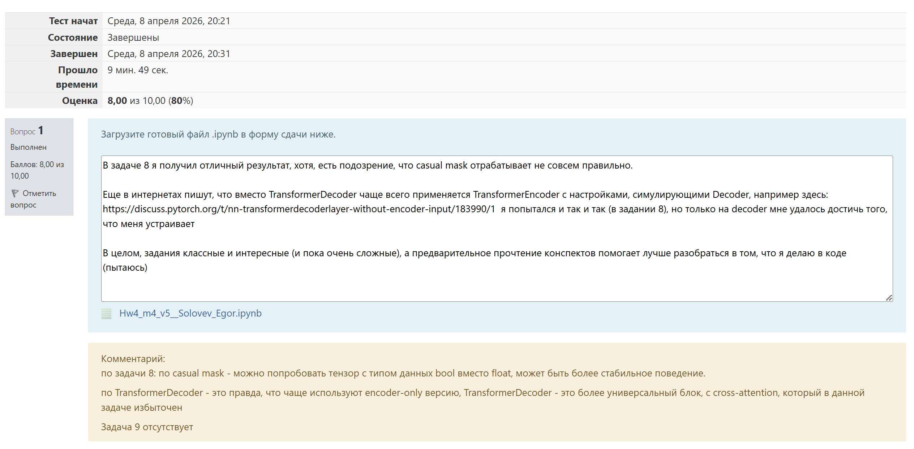

# DeepLearning__MIPT
Здесь я выкладываю выполненные домашки МФТИ по Глубокому обучению

-----
## **Домашнее задание 4. Механизм внимания и архитектура Transformer**
### Цели задания:
Понять ограничения рекуррентных сетей и мотивацию появления механизма внимания.
Освоить формулы scaled dot-product attention.
Разобраться в механике multi-head attention и структуре слоя Transformer.
Научиться реализовывать компоненты Transformer с нуля без использования готовых модулей.
Понять роль позиционного кодирования и маскирования (causal, padding).
Сравнить Transformer и RNN на задаче моделирования дальних зависимостей.
Реализовать упрощенную decoder-only языковую модель и исследовать стратегии декодирования.

### Условия:
Домашнее задание состоит из 9 задач, разделенных на три уровня сложности. Задачи выстроены последовательно: от ручного вычисления attention и анализа размерностей до сборки собственных модулей Transformer и обучения простой языковой модели.

### Структура по уровням сложности:

Простые задачи (1–4) — 3 балла (0.75 за задачу).  
Средние задачи (5–7) — 3 балла (1 балл за задачу).  
Сложные задачи (8–9) — 4 балла (2 балла за задачу).  
Итого — 10 баллов.  

Условия прописаны в блокноте `4_homework_m4_v5_students_2.ipynb`. Там же нужно выполнять само задание.

### Оценка 

-----
## **Домашнее задание 5. Генеративные модели**
### Цели задания:
 * Понять, как автоэнкодер обучается сжимать и восстанавливать данные
 * Освоить базовую реализацию вариационного автоэнкодера и функцию потерь на основе ELBO
 * Научиться сравнивать AE и VAE по качеству реконструкции и визуально, и количественно
 * Проанализировать структуру латентного пространства и поведение моделей при интерполяции
 * Сравнить разнообразие и реализм сэмплов, полученных от AE и VAE
 * Интерпретировать влияние архитектуры и гиперпараметров на свойства генеративных моделей

### Условия:
Домашнее задание состоит из 9 задач, разделенных на три уровня сложности:
 * Простые задачи (1–4) — 3 балла (0.75 за задачу)  
 * Средние задачи (5–7) — 3 балла (1 балл за задачу)  
 * Сложные задачи (8–9) — 4 балла (2 балла за задачу)  

Итого — 10 баллов  

Условия прописаны в блокноте `m5_homework_ae_vae_student.ipynb`. Там же нужно выполнять само задание.

### Оценка 

